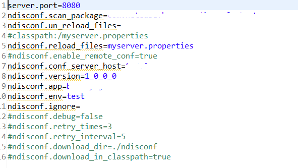

# ndisconf

>author: Dorae  
>基于disconf改造，二次封装

# 相比于disconf的特点

## 工程结构
	
	ndisconf-server
	ndisconf-starter
	starter-test
	nsb-test

### ndisconf-server

1. 改造成springboot项目；
2. 添加区域的概念，使得配置中心可以分区域集群部署；
3. 整合分散的配置文件，可以根据配置文件区分不同环境。

### ndisconf-starter

1. 对disonf的jar进行了一层封装，屏蔽了复杂的配置项（提供默认值，因为这些通常是不需要的）；
2. 采用java配置的方式，屏蔽了项目引入disconf的xml配置；
3. 现在只需要引入简单的配置即可。

### starter-test

使用ndisconf-starter的Demo工程，提供了配置示例以及原生的disconf使用示例。

### nsb-test

原生disconf-core的Demo工程，提供了xml配置示例以及原生的disconf使用示例。

## 使用方式

1. 部署ndisconf-server工程（配置管理中心）；
2. 工程引入ndisconf-starter依赖；
3. 简单的配置（springboot的propertie文件）。

## 配置示例：

